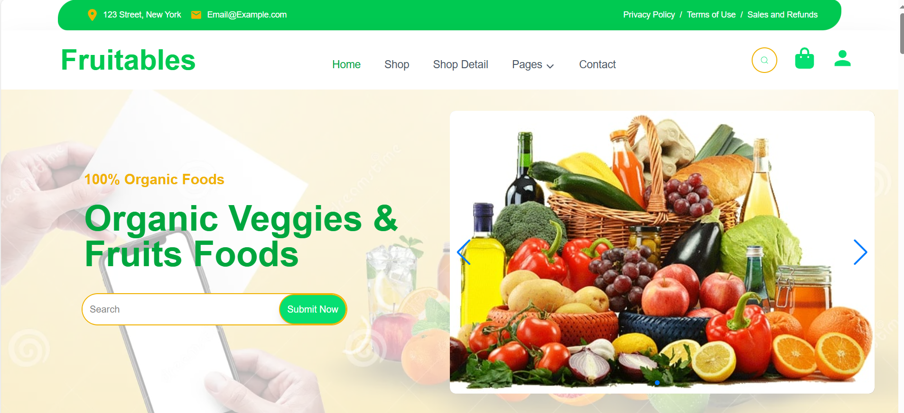
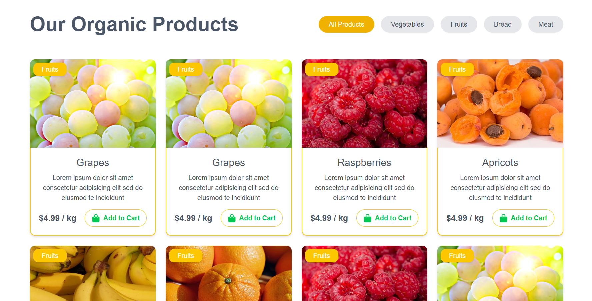
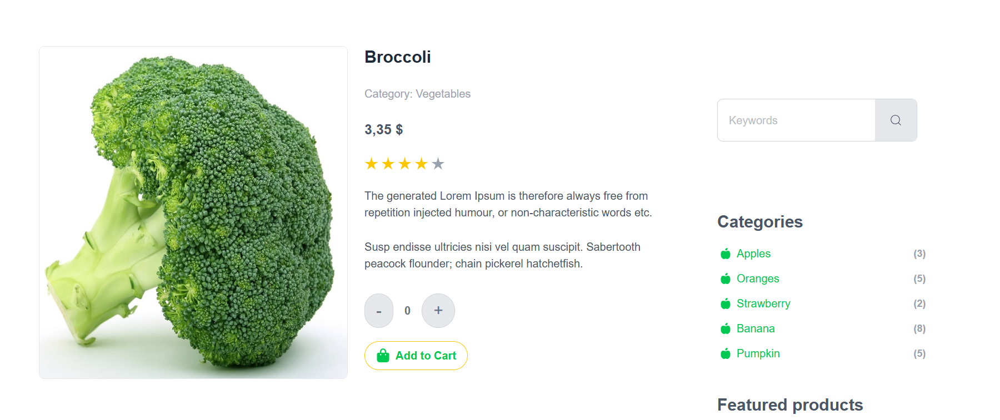
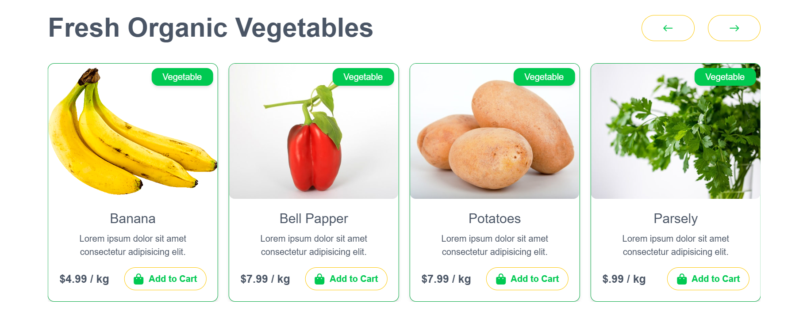
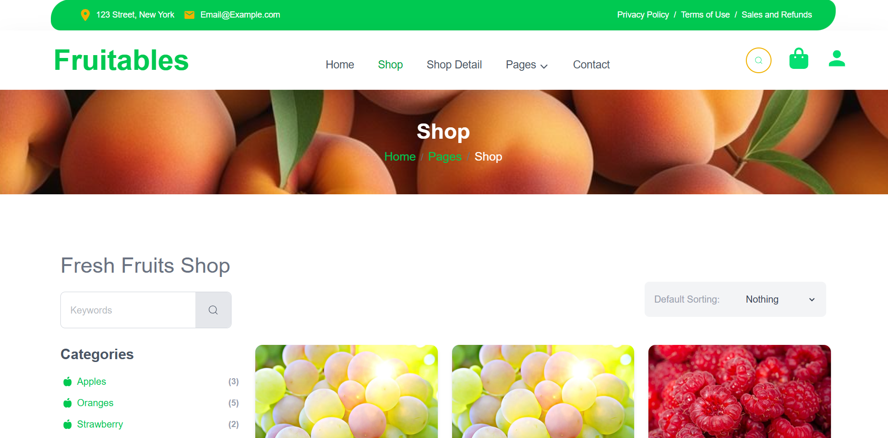
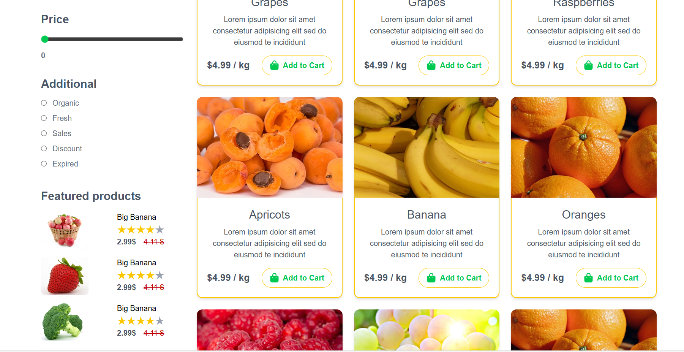
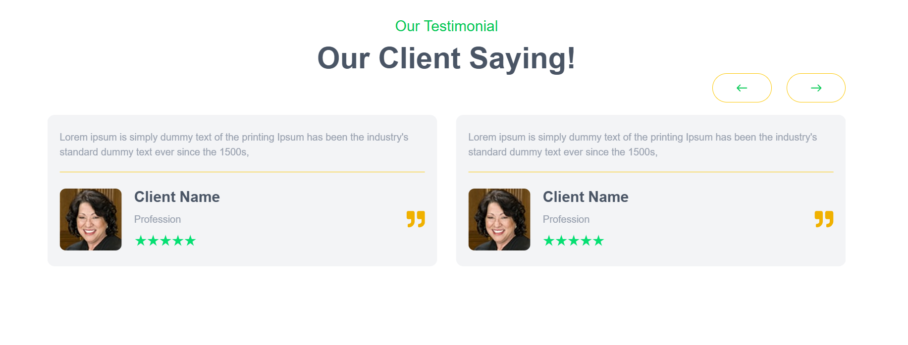
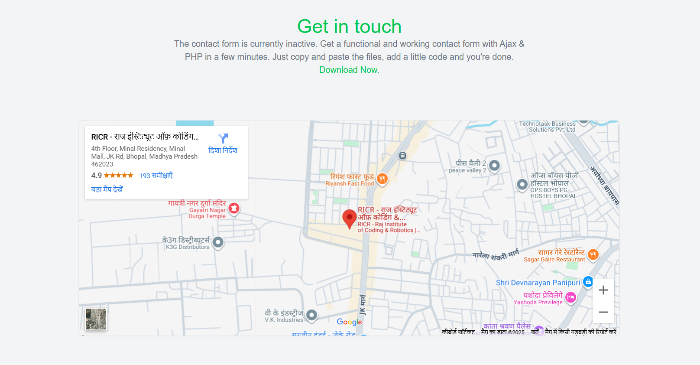
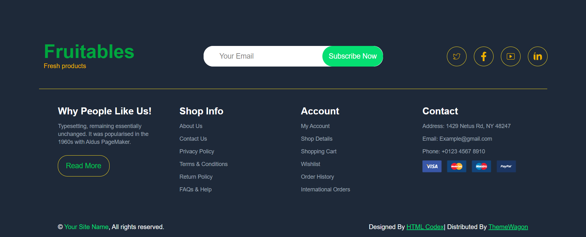

# 🛒 Fruitables – E-Commerce Frontend  

A **desktop-responsive e-commerce frontend** inspired by **Fruitables**, developed with **React (Vite)** and **Tailwind CSS**.  
This project is purely **UI-focused** – showcasing product listings and pages with a modern design (no backend or cart/search functionality).  

  
  
  

---

## 🚀 Features  

- ✅ Desktop-responsive design  
- ✅ Landing page with banner & hero section  
- ✅ Product listing grid with categories (fruits, vegetables, bread, meat)  
- ✅ Product detail page layout  
- ✅ Clean UI built with Tailwind CSS  
- ❌ No backend / cart / search functionality  

---

## 🛠 Tech Stack  

- **Frontend:** React.js (Vite)  
- **Styling:** Tailwind CSS  
- **UI Components:** Custom React Components  

---

## 📸 Screenshots  

### 🏠 Home Page (Hero Section)  
  

### 🛍️ Product Listing Page (Grid View)  
  

### 📄 Product Details Page  
  

### 🎞️ Slider Section  
  
 
### 🛒 Shop Page  
  

### 🛒 Shop Page (Variation)  
  

### 💬 Testimonial Section  
  

### 🗺️ Map Section  
 

### 📑 Footer Section  
  


---

## ⚙️ Installation  

```bash
# Clone repo
git clone https://github.com/your-username/fruitables-frontend.git

# Go to project
cd fruitables-frontend

# Install dependencies
npm install

# Run locally
npm run dev
